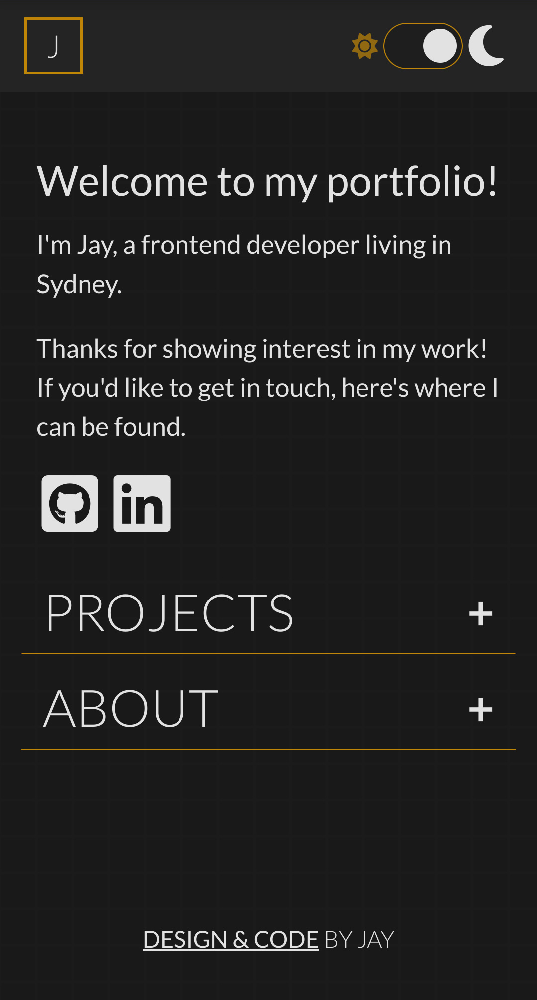
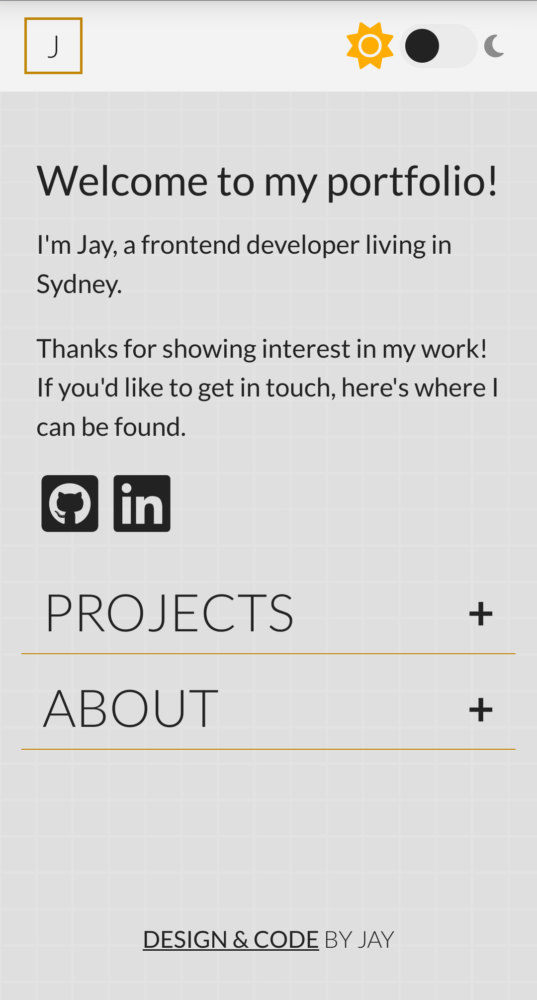
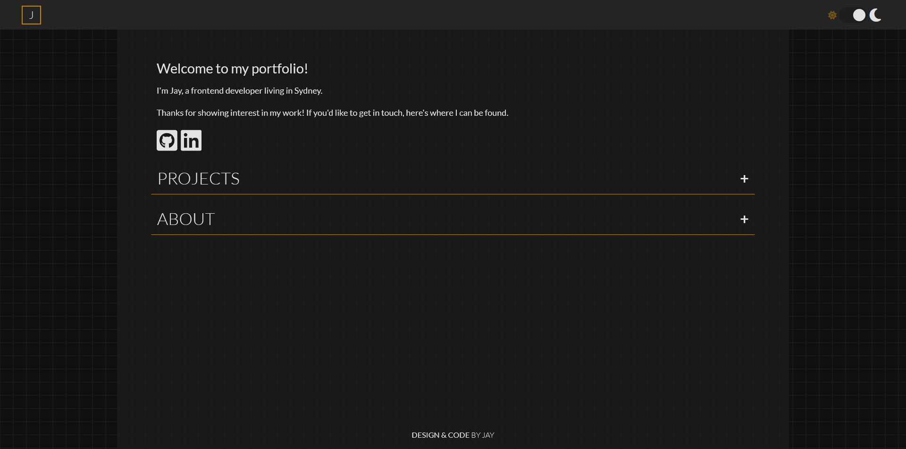
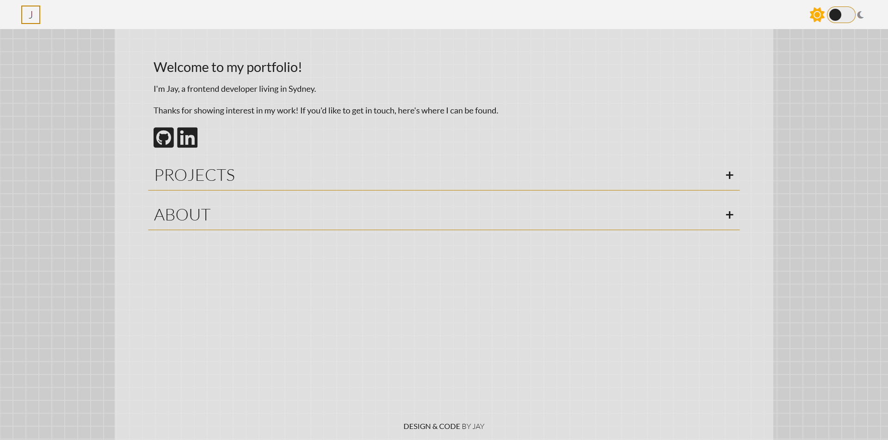

# portfolio

My portfolio website!

I am building this with HTML, CSS and JavaScript, without any frameworks, or CMS templates. In doing so, I am hoping to show that I have strong foundational skills in these languages.

## Goals

What I want from my portfolio website:
- One-page layout
- Snappy user experience
    - Smooth and responsive animations, used appropriately
    - Minimal lag
    - Automatic dark mode + manual light/dark mode setting
- Classy design
    - I want this website to stand out without trying to do too much
    - It should have a spin that is "uniquely me"
    - It should still be a pleasant viewing experience

## Notes (post-project)

I'm really happy with this website! And, as intended, I learned MANY things while building it. My main takeaway from this project is the reassurance that I do actually really enjoy doing web development work. I ran into all kinds of obstacles, and even though they were a little frustrating, I had a great time solving them.

Revisiting this website after finishing up on [amberial.com](https://github.com/jaysgitaccount/amberial.com), it's really clear how much of the work frameworks do for you.

## Learnings

### Running a server using http-server npm

I created a local server to host my website so I could easily test it on multiple devices.
- `npm install -g http-server`
- `ifconfig`, which didn't work because...
- I had to install net tools `sudo apt install net-tools`
- On running `ifconfig`: I needed to change my NAT1 to "bridged". This is because I'm running a virtual machine, and my connection was through my Windows PC instead of directly to the router. My VM needed its own IP address from the router.
- Running `http-server` in the project directory will give me the port, which needs to be appended to `localhost:`, e.g. `localhost:xxxx`
- Putting this in the browser address bar will take any device on the Wi-Fi to my website.

For live reload, run `watch-http-server` instead (an additional npm package installed with `npm install -g watch-http-server`). Adds JavaScript that automatically reloads if any file is changed.

NOTE: `watch-http-server` didn't do anything until I added `-c-1` to the command, which disables caching (so that refreshing actually changes the page). This can also be done via the Inspector.

Very cool!

### Commit messages

    If applied, this commit will <your subject line here>

I just read an article about this rule for writing commit messages. I don't think I've ever seen anyone do this at any of my previous workplaces, but I'm happy to try it out.
I think that keeping this rule in mind will ensure that each commit actually adds something to the project, but not more than one thing.

Style guide:
- Capital letter at the start of the subject line
- Imperative tone (like you're issuing a command, e.g. "switch between light and dark mode")
- Don't assume code is self-documenting, or the reader understands the original problem.
- For commits that need explanation, use VS code and have the first line be the "title", and the following paragraphs be the explanation (remember: why, not how). Wrap lines at 72 chars.
- Commit subject lines (the title) need to be under 50 characters. No full stops needed at the end of a sentence (wasted character)
- Atomic commits: each commit should do one thing only. Also a PR should aim to fix only one bug or add one new feature, and should only contain multiple commits if that is required to fix the bug or implement the feature.

### HTML Semantics

- `<section></section>` is for distinct *sections*. It is standard practice but not compulsory (according to MDN) to have a header tag *before* each section. I might not be doing that since I have collapsible sections, unless you can put headers inside buttons.
- Apparently it's poor practice to use anything that isn't an anchor for links, because all links need to be able to be focused (by pressing TAB to select it). So, making a button out of a div without an a is bad.
- The HTML tags you choose for an element must be informed by your intentions for the element. e.g, use `<nav></nav>` for navigation bars, `<main></main>` for the *main content* on the page.
- `

` and `` should only be used when there are no other appropriate tags. e.g. instead of using a div for a user comment, you should use `<article></article>`. Spans are like divs, except they are intended for inline elements.

### Light/Dark mode

I wanted the user to be able to start with their preferred mode, AND be able to switch between them as desired. 

### Rotating Text

Text can only be rotated if it is not inline.

### Interactive Pseudo-classes

Learnings from being confused about anchor pseudo-classes:

- focus-visible can be used to differentiate keyboard vs mouse input. Might be a better idea not to touch it/make it the same as hover.
- focus-within can be used to affect a parent element based on the existence/state of child elements.

### maxHeight = null

    content.style.maxHeight
        ? content.style.maxHeight = null
        : content.style.maxHeight = content.scrollHeight + 'px';

`? content.style.maxHeight = null` works, but `? content.style.maxHeight = 0` does not (you can only open and close once). Why?

Doing `content.style.maxHeight === 0` as a check along with `= 0` also doesn't work.

### Sticky header

Default: transform: none;
Helper class: .scrolldown { transform: translateY(-100%); }

Create lastScroll = 0; for storing the previous scroll pos.
Add event listener "scroll" to the window that, on scroll, saves the current pageYOffset of window.
If pageYOffset is negative (scroll down), add .scrolldown to header.
If pageYOffset is positive (scroll up), remove .scrolldown (toggle?).

### The "J" Logo

This seemed like a good idea in my head, until duplicate letters started appearing when you quickly moved your mouse on and off the logo. In order to fix this, I learned `setTimeout()` and `clearTimeout()`.

### Parallax background

I didn't want to leave the background plain, so I learned how to draw on HTML Canvas for a subtle grid background. 

I ran into trouble making the parallax effect work for multiple reasons:

I was doing `addEventListener( 'scroll', animateScroll() )`, which ran the function once on execution and not any further. What I actually wanted was `addEventListener( 'scroll', animateScroll )`, which creates a reference to the function that will then run each time. 

I had stored the variables for `animateScroll()` inside the function, so `totalOffset` was reset each time the function ran.

### Function declarations vs expressions

A function declaration, `function executeFunction() { }` is hoisted to the top of the scope.

A function expression, `const variableName = function () { }` (or `() => { }`) is the creation of an anonymous function and the creation of a variable, and the assignment of the anon. function to that variable. These do not hoist to the top. Declaring a function expression with `let` (or `var`) will mean that the variable itself is hoisted, but the function is not initialised, you will get `undefined`.

Additionally, declaring a function expression with `const` will remove the danger of accidentally redeclaring that name.

## Images

Mobile images taken on Chrome (Android), desktop images taken on Firefox (Windows)

